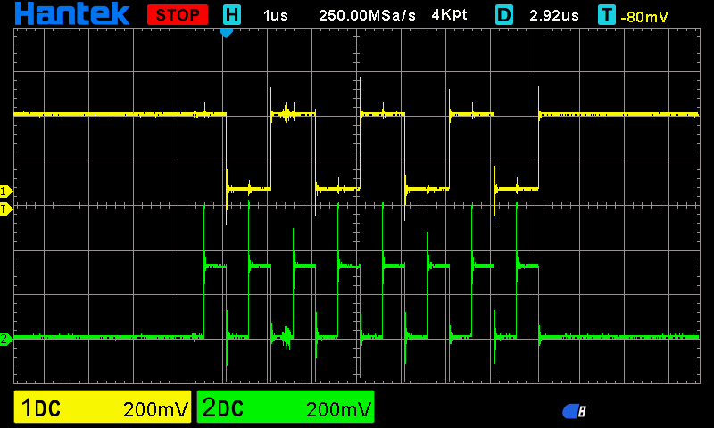

# SPI Example #

This example shows how to enable and use an SPI bus on Teensy 4.1.

For this example to work both MOSI and MISO must be shorted.
The message printed should be: ```TX=0xAA RX=0xAA```

It can also be verified with an oscilloscope. When probing the SCK and MOSI/MISO pins it should display something like:
 <br>

Where the yellow and green represent the clock(SCK) and the data(MISO/MOSI) respectively.

### Pin configuration:
 - cs - 10 (B0_00)
 - sck - 13 (B0_03)
 - sdo - 11 (B0_02)
 - sdi - 12 (B0_01)

*Source* ```/home/$USER/zephyrproject/zephyr/boards/pjrc/teensy4/teensy4-pinctrl.dtsi``` -> **<pinmux_lpspi4>**